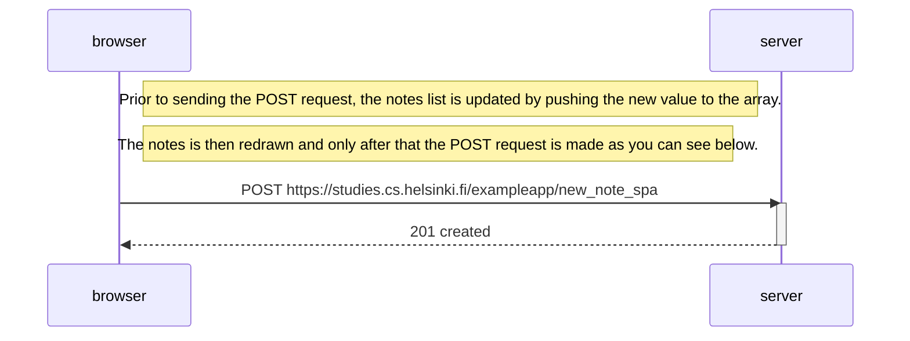

```mermaid
sequenceDiagram
    participant browser
    participant server

    Note right of browser: Prior to sending the POST request, the notes list is updated by pushing the new value to the array.
    Note right of browser: The notes is then redrawn and only after that the POST request is made as you can see below.

    browser->>server: POST https://studies.cs.helsinki.fi/exampleapp/new_note_spa
    activate server
    server-->>browser: 201 created
    deactivate server
```
